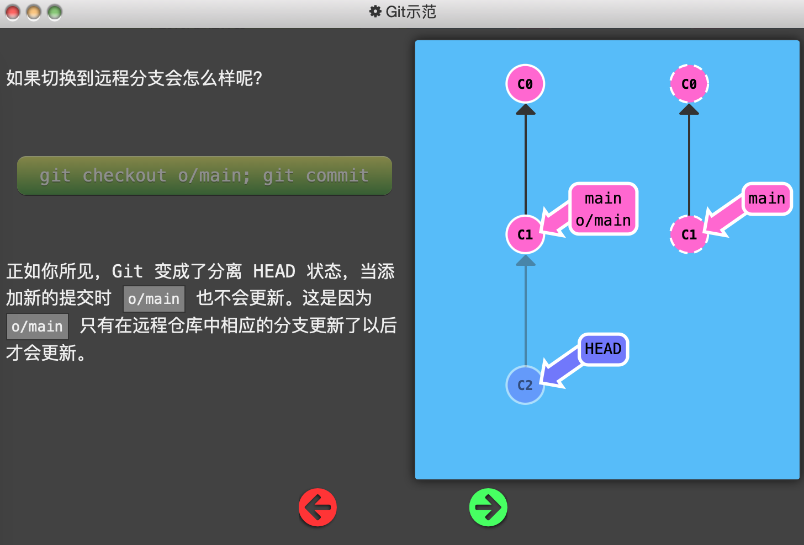
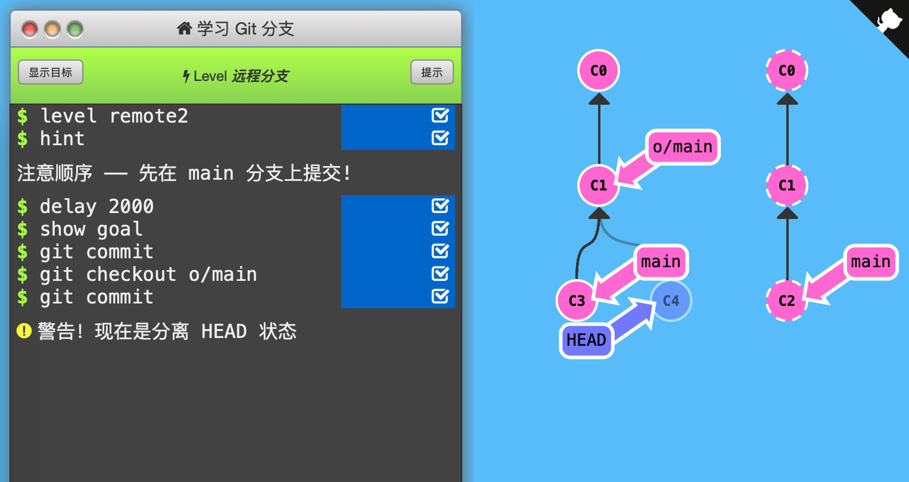

2. 远程分支

   `git clone`命令让本地仓库多了一个名为`o/main`的「远程分支」。远程分支反映了远程仓库(在你上次和它通信时)的**状态**。

   

   「远程分支」的命名规范：`<remote name>/<branch name>`。因此名为`o/main`的「远程分支」的含义是远程仓库`o`上的分支`main`。（一般将远程仓库命名为`origin`，这里为了简洁使用`o`）

   

   切换到远程分支时，自动进入分离 HEAD 状态。因为你不能直接在这些分支上进行操作，要在别的地方完成工作，再用远程分享工作成果。

   

   下面的例子说明了上面“切换到远程分支时，自动进入分离 HEAD 状态”和“不能直接在这些分支上进行操作”。

   

   

   通关记录：（初始状态：C1 o/main，C3 main*，右边远程仓库一样）

   

   