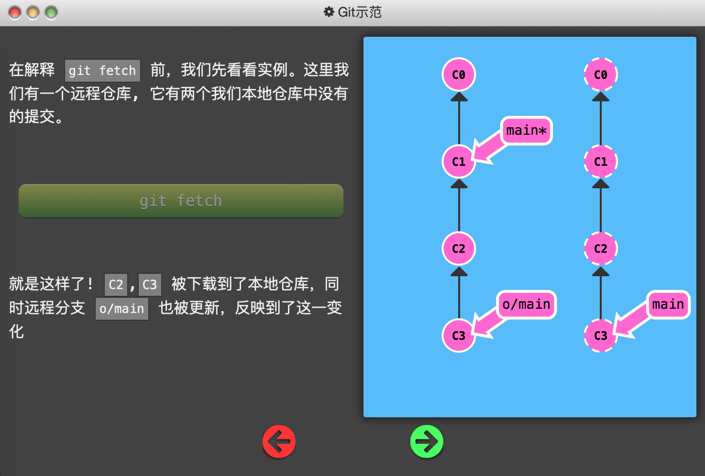
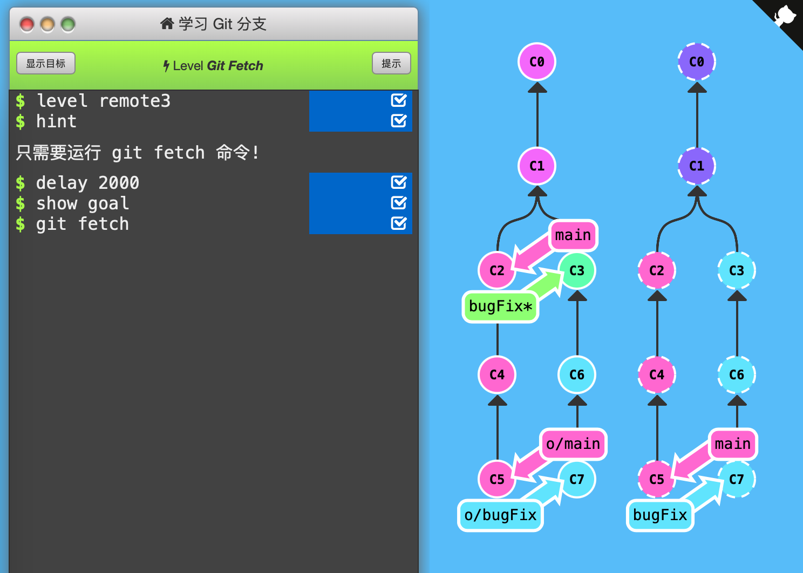

3. Git Fetch

   `git fetch`命令从远程仓库获取数据，同时远程分支（`o/main`）也会更新，以同步最新的远程仓库。总结来说`git fetch`：

   - 从远程仓库下载本地仓库中缺失的提交记录
   - 更新远程分支指针(如 `o/main`)到远程仓库相应分支的最新状态
   - 仅仅下载了数据，不会修改磁盘上的文件

   

   

   

   通关记录：一次fetch即可，下载所有缺失的数据，并更新远程分支。

   

   