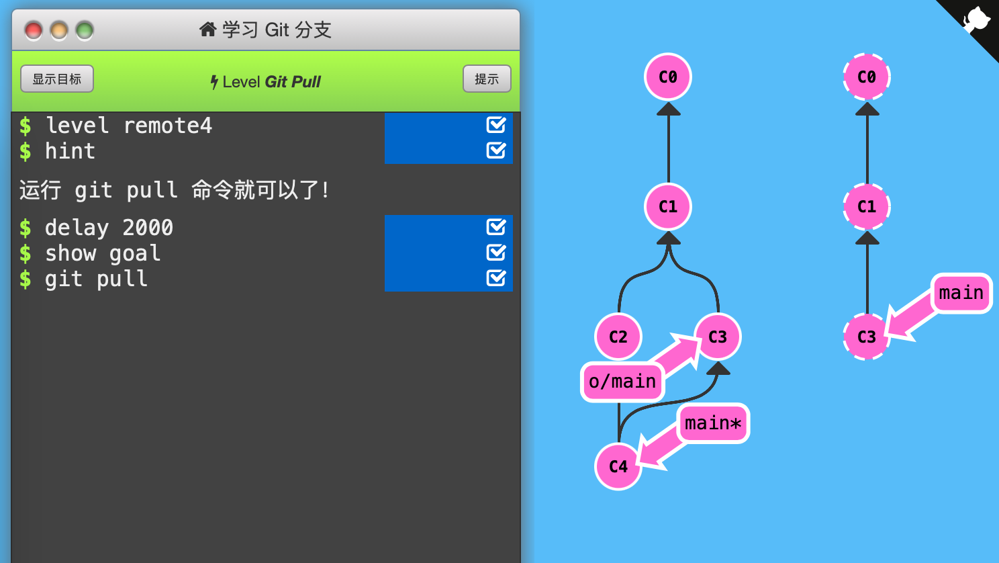

4. Git Pull

   ​	`git fetch`只获取了远程数据，现在要将这些改变更新到本地仓库。如，`git fetch`更新了远程分支后，我们像合并本地分支一样合并远程分支，即使用下面的命令：

   - `git cherry-pick o/main`
   - `git rebase o/main`
   - `git merge o/main`

   `git pull`命令允许我们先抓取更新，再合并到本地分支。即`git pull` = `git fetch;git merge o/main`。

   

   