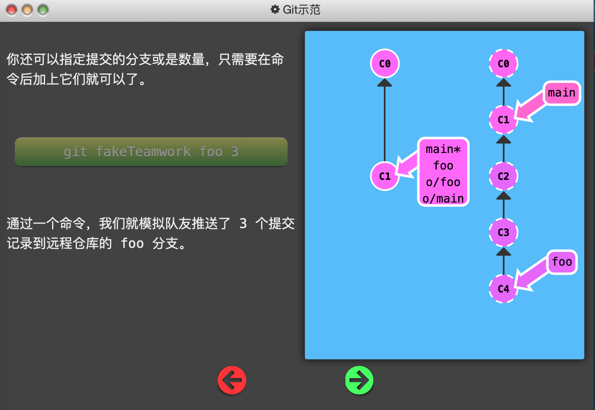
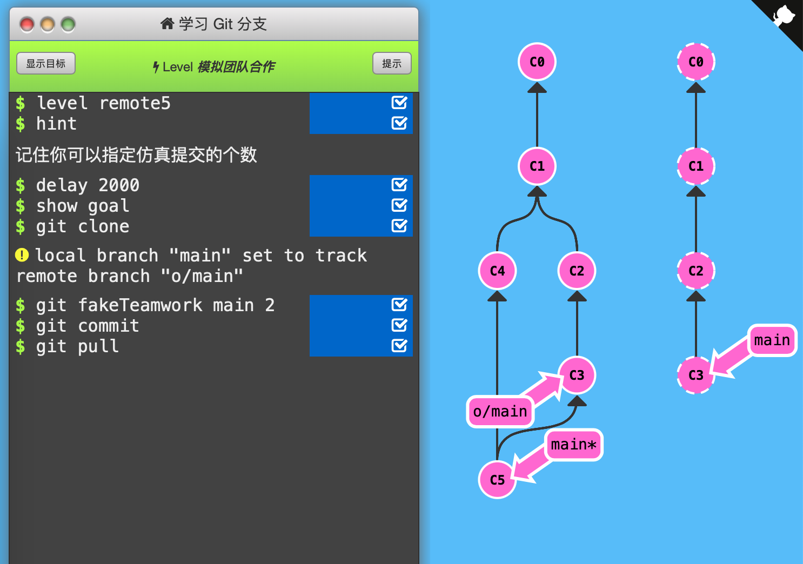

5. 模拟团队合作

   这节课程给出了一种不存在的命令`git fakeTeamwork`，用来模拟团队协作。这条命令可以让远程仓库的指定分支提交指定次数。

   

   

   

   通关记录：（初始状态：C0，C1 main*）

   

   注意要先`git commit`再`git pull`。如果先pull，o/main分支先更新到C3，而`git pull`是包含了`git merge o/main`的，即此时main*会跟随o/main指向C3。

   

   