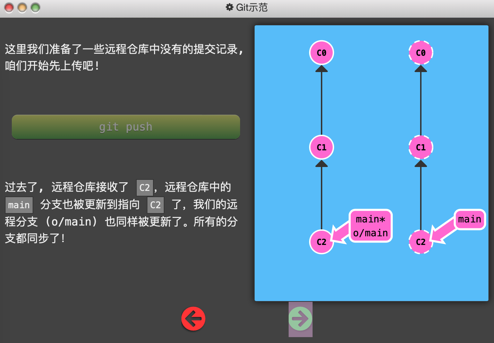
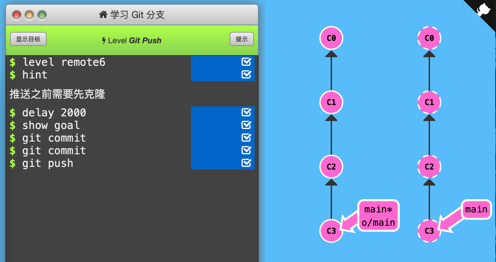

6. Git Push

   `git push` 负责将**你的**变更「上传」到指定的远程仓库，并在远程仓库上合并你的新提交记录。

   

   下面的例子中，初始状态为C1 o/main，C2 main\*，远程仓库C1 main，没有C2。即两边仓库的main分支状态是一样的，这可能是因为刚clone，还没有更新。但本地仓库已经更新到了C2 main\*，需要将远程仓库同步更新到C2，`git push`命令同时更新了o/main和main两个分支（和`git pull`一样）。

   

   

   

   通关记录：（初始状态：C0，C1 main*，o/main；远程仓库，C0，C1 main）

   

   