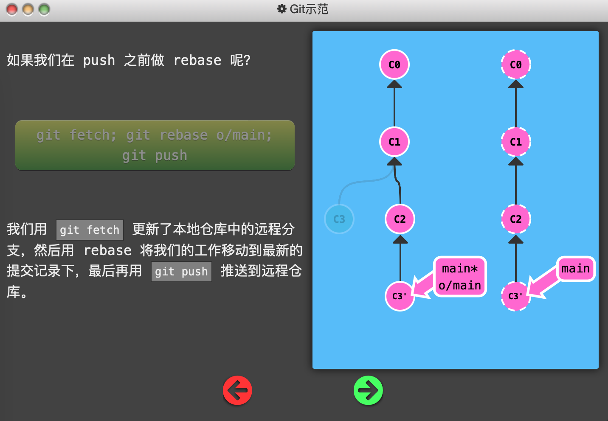
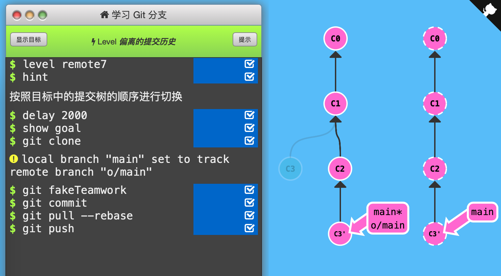

7. 偏离的提交历史

   先介绍提交历史的「偏离」（diverge）。你克隆了一个仓库并花费数日进行开发，但这数日内远程仓库被同事修改（重要的是改了API），导致你的工作变成基于旧版本的，与远程仓库的最新版代码不匹配。

   

   此时不能用`git push`命令变更，Git强制你先合并远程最新代码，再分享你的工作（回想每次push都要先pull并解决冲突）。

   

   下面例子中，初始状态为：C0，C1 o/main，C3 main*；远程仓库，C0，C1，C2 main。此时直接`git push`是没用的，因此远程仓库最新版和本地仓库不匹配。

   

   因此，需要先抓取远程仓库的新内容C2，再将本地分支rebase到C2下面（这一步需要解决冲突，也可以使用`git merge o/main`创建新的合并提交，反正需要先合并远程仓库的变更）成为C3'，再`git push`到远程仓库。

   

   

   

   前面已经介绍过 `git pull` 就是 fetch 和 merge 的简写，类似的 `git pull --rebase` 就是 fetch 和 rebase 的简写！上面的例子中命令可以简化为`git pull --rebase; git push`。如果用merge合并，则是`git pull; git push`。这也是最常用最简单的方式。

   

   通关记录：（初始状态：C0，C1 main*）

   

   