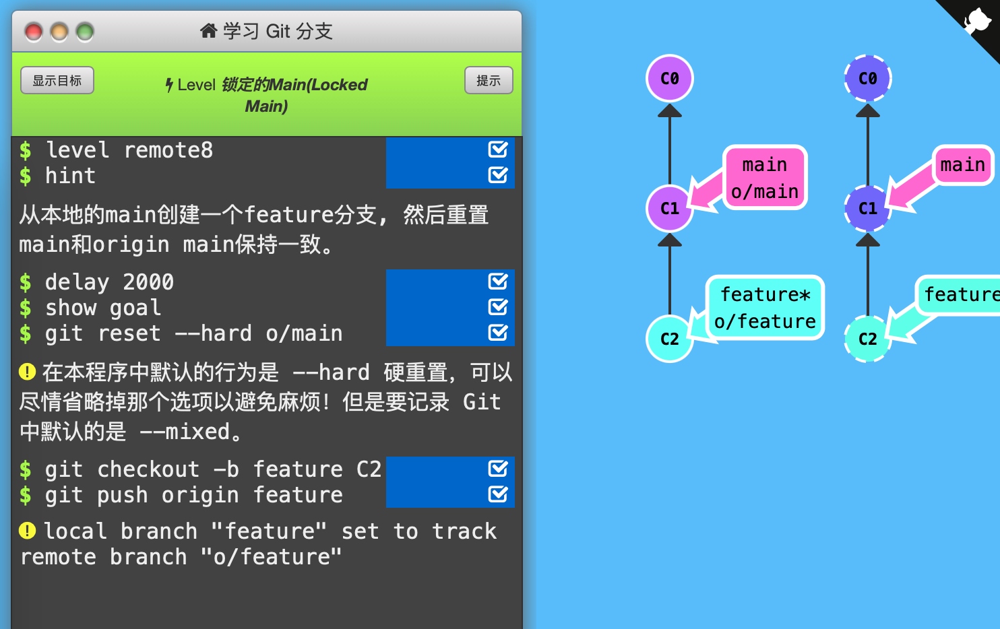

8. 锁定的Main（Locked Main）

   大的团队合作中，main可能被锁定，需要pull request来合并修改。如果直接commit到本地main，然后尝试push，会报错：

   

   >! [远程服务器拒绝] main -> main (TF402455: 不允许推送(push)这个分支; 你必须使用pull request来更新这个分支.)

   

   远程服务器拒绝直接push提交到main，是因为策略配置要求pull requests来提交更新（这样可以保护main分支不被太多开发者弄乱，例如Linux，不可能全球开发者都push到main上）

   

   通关记录：（初始状态：C0，C1 o/main，C2 main*；远程仓库，C0，C1 main）

   

   `git reset`可以不需要-- hard参数，该命令将main*指向了o/main。接着`git checkout -b feature C2`创建新分支feature并指向C2，且HEAD指向feature分支。接着就可以用`git push origin feature`（origin是远程仓库名字，feature是要推送分支名）将feature分支push到远程仓库了，而不需要影响远程仓库的main分支。

   

   