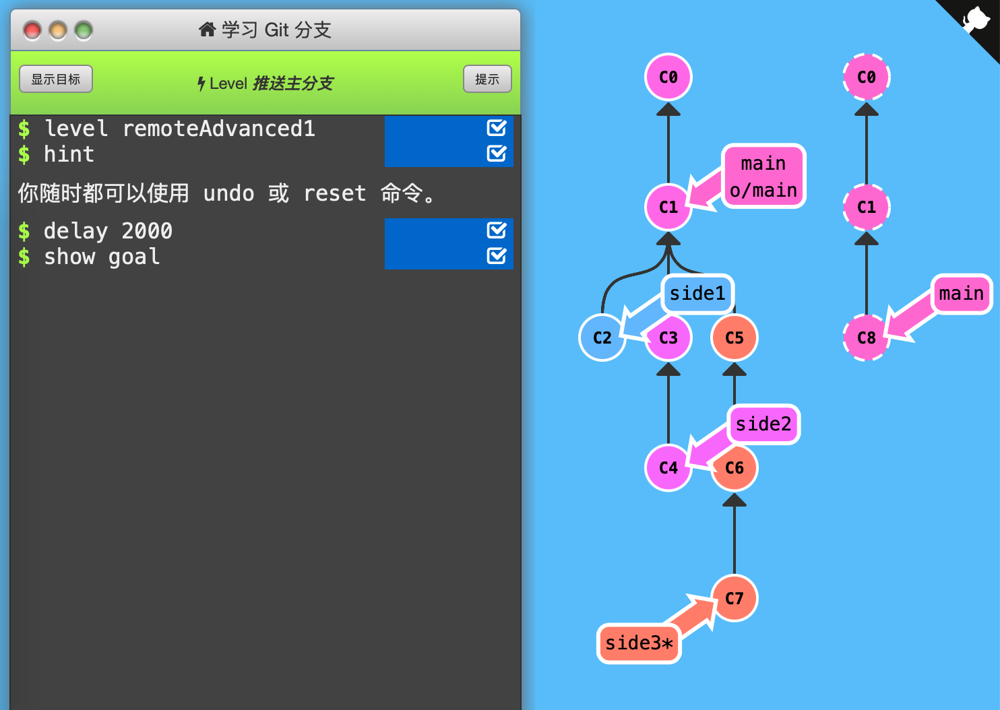
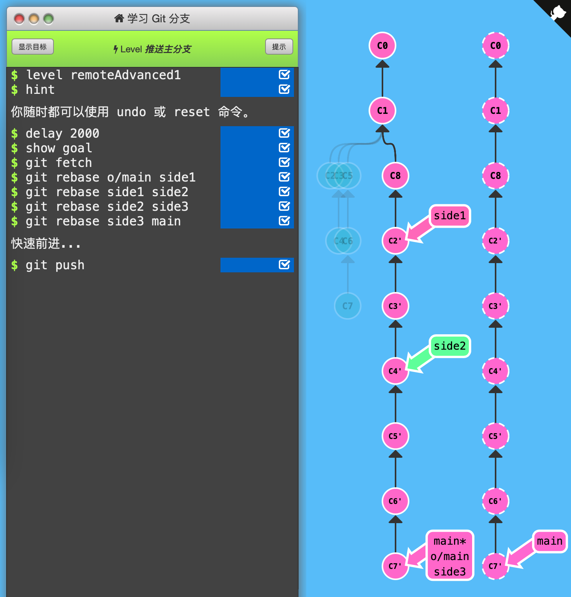

1. 推送主分支

   通常在main分支之外的特性分支上工作，工作完成后集成到main上，然后推送并更新远程分支。

   

   下面例子的初始状态：本地有C0，C1 o/main，C2 main*；远程有C0，C1，C3 main。现在要更新main分支（从远程仓库拉取最新版本）并推送本地更新到远程。

   

   `git pull --rebase`命令将本地最新版本C2 rebase到远程分支最新的提交记录（C3），这样就完成了本地和远程更改的合并；`git pull`则向远程推送了本地的工作。

   

   本题通关需要先将远程工作合并过来，然后推送3个特性分支。

   

   通关记录：

   

   初始状态：

   

   

   

   先`git fetch`抓取远程最新版本C8到C1底下，此时o/main指向C8。然后依次`git rebase branch1 branch2`将side1加到o/main下、将side2加到side1下、将side3加到side2下、将main指向side3指向的C7。最后`git push`推送到远程仓库。

   

   