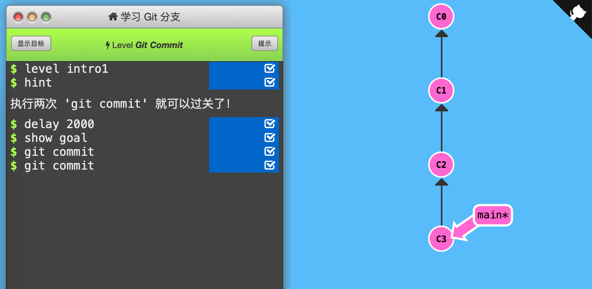

1. Git Commit

   「提交」保存目录下所有文件快照，「提交记录」可以看作整个项目的快照（轻量级，非全盘复制）

   

   每次「提交」时只把所有的差异打包到一起作为一个「提交记录」

   

   Git 还保存了提交的历史记录，因此每个「提交记录」（图中的一个节点）上都有父节点

   

   修改代码库后，使用`git commit`，在当前所处的「提交记录」下创建新的「提交记录」（向下生成一个子节点），并移动到该节点上。

   

   通关记录：（初始状态：C0，C1（main*））

   

   