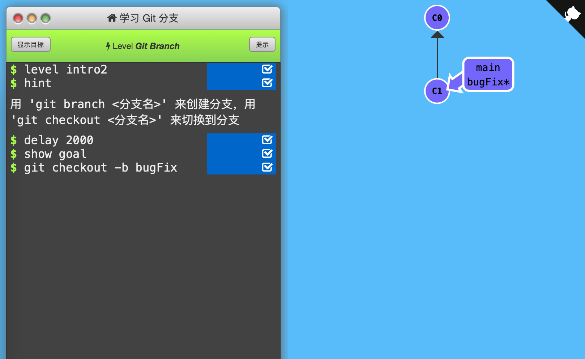

2. Git Branch

   Git的「分支」指向某个提交记录。

   

   「分支」非常轻量，创建再多的分支也不会造成储存或内存上的开销，并且按逻辑分解工作到不同的分支要比维护那些特别臃肿的分支简单多了。

   

   因此提倡「早建分支！多用分支！」

   

   使用「分支」相当于“基于这个提交以及它所有的父提交进行新的工作”。

   

   使用`git branch branch_name`创建新分支，但默认HEAD还在原来main分支上，此时commit会使main分支前进，新分支待在原地。

   

   使用`git checkout branch_name`切换到新分支上。（新版本Git使用git switch代替git checkout）

   

   创建新分支的同时切换到新分支上：`git checkout -b branch_name`

   

   通关记录：（初始状态：C0，C1（main*））

   

   