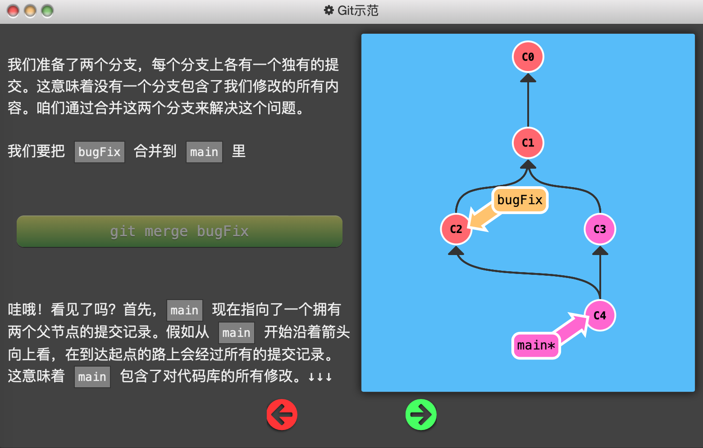
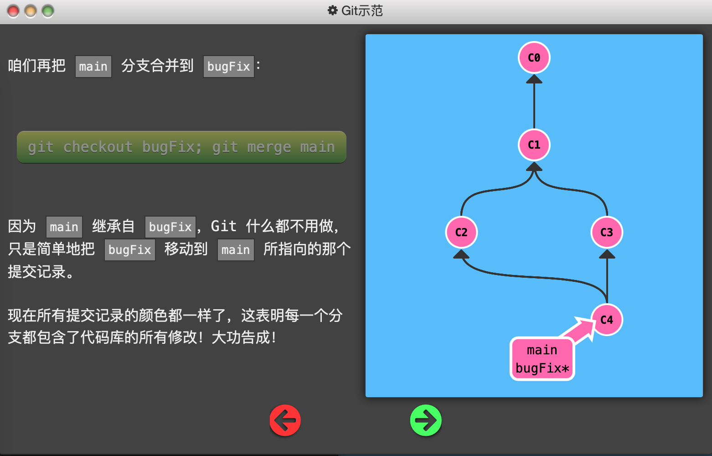
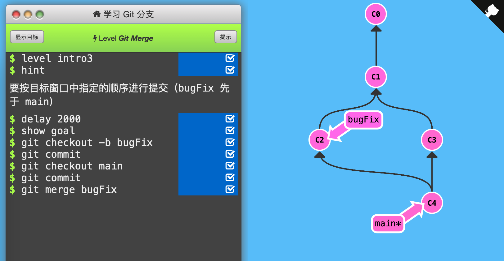

3. Git Merge

   创建新分支，在其上开发某个新功能，开发完成后再合并回主线。

   

   使用`git merge branch_name`（其中branch_name是要合并到当前分支的分支名）「合并」两个分支。

   

   此时会产生一个特殊的提交记录，它有两个父节点。相当于“把这两个父节点本身及它们所有的祖先都包含进来。”

   

   

   

   如果要「合并」的分支是当前分支的父节点，Git 什么都不用做，只是把那个分支移动到当前分支所指的提交记录上。

   

   

   

   通关记录：（初始状态：C0，C1（main*））

   

   