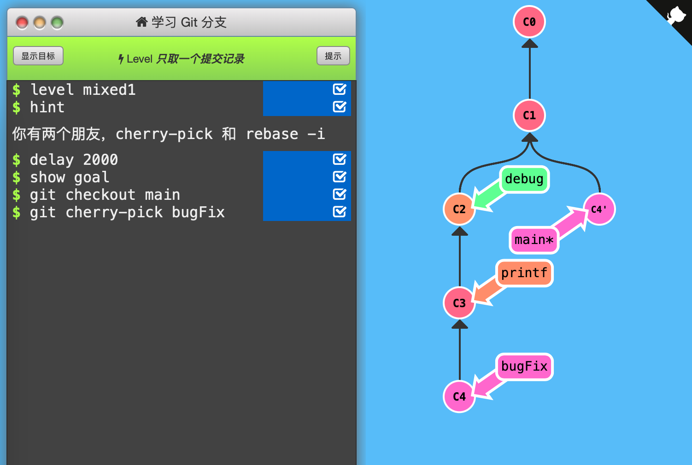
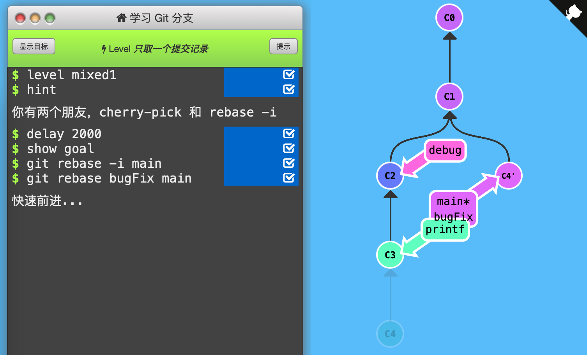

1. 只取一个提交记录

   通关记录：（初始状态：C1 main，C2 debug，C3 printf， C4 bugFix\*，本关只检查main\*的位置）

   

   法1:HEAD转移到main上，再用cherry-pick把bugFix复制到main*下。

   

   

   

   法2:交互式rebase将bugFix到main的C2~C4三个提交记录指定只保留C4，并接在main下面，再用rebase将main移动到bugFix并指定为HEAD所在处。

   

   