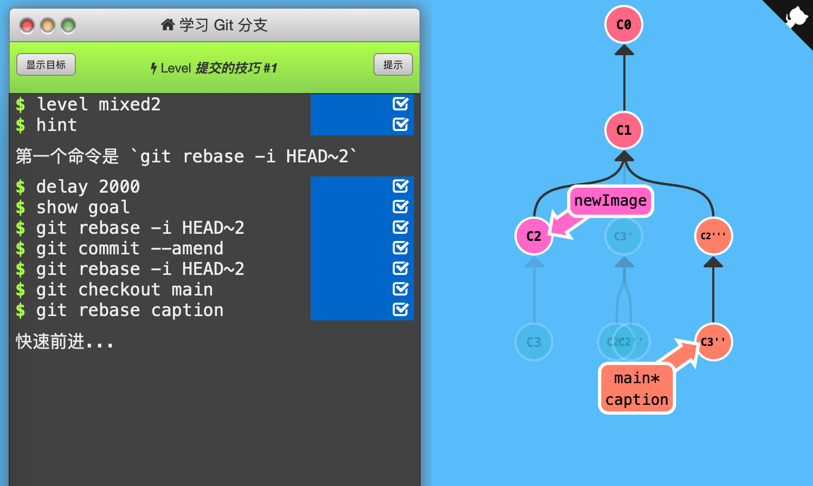

2. 提交的技巧 #1

   本节解决一种情况：希望在某个分支的旧版本上作修改，如有C1-C2-C3，希望修改C2，又要保留C3的修改。

   

   方法：`git rebase -i`重新排序提交记录，把希望修改的提交记录放在最前面用`git commit --amend`修改（这样新的提交记录是平行的，而不是在下面新添加），再用`git rebase -i`排序回来，最后把main分支移动到最新版本。

   

   通关记录：（初始状态：C1 main，C2 newImage，C3 caption，本关只检查main\*的位置）

   

   思路：

   首先`git rebase -i HEAD~2`，交换C2、C3位置，作为新提交记录添加在C1下面，此时caption*指向C2'；

   然后`git commit --amend`平行增加新提交记录C2''；再`git rebase -i HEAD~2`交换回C2、C3位置；

   接着`git checkout main`+`git rebase caption`把main分支前进到最新版本。

   

   