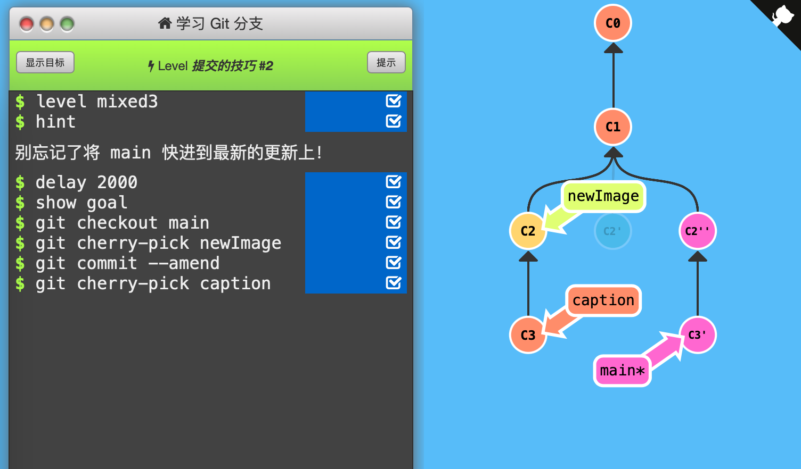

3. 提交的技巧 #2

   还是上面一节的问题，这次用cherry-pick解决。

   

   通关记录：（初始状态：C1 main，C2 newImage，C3 caption）

   

   思路：

   先把HEAD移动到main上；

   然后`git cherry-pick C2`取出非最新版的提交记录C2，接在main*下面；

   接着`git commit --amend`修改C2'并与其平行放置；

   最后`git cherry-pick C2`取回C2后面的修改C3 caption，接在修改完毕的C2''下面。

   

   