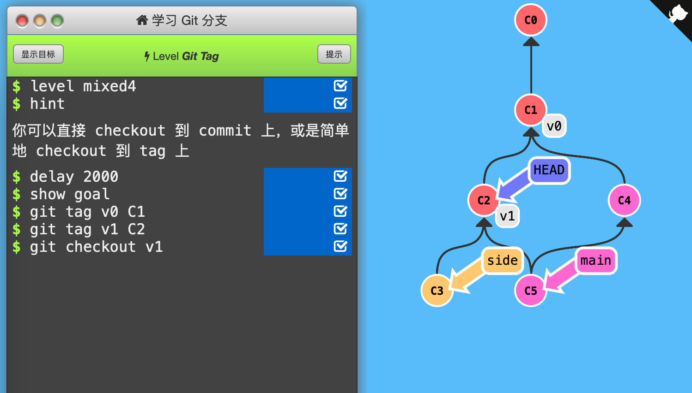

4. Git Tag

   Git的tag可以永久地将某个特定的提交命名为里程碑，然后就可以像分支一样引用了。

   

   它们并不会随着新的提交而移动。你也不能切换到某个标签上面进行修改提交，它就像是提交树上的一个锚点，标识了某个特定的位置。

   

   具体用法：`git tag v1 C1`，将标签v1贴在提交记录C1上，如果不指定提交记录，则使用HEAD所指向的位置。

   

   通关记录：（初始状态：节点无变化，各个分支指向为：C3 side，C5 main*）

   

   按照目标增添2个tag、分离HEAD到v1所在提交记录即可。

   

   