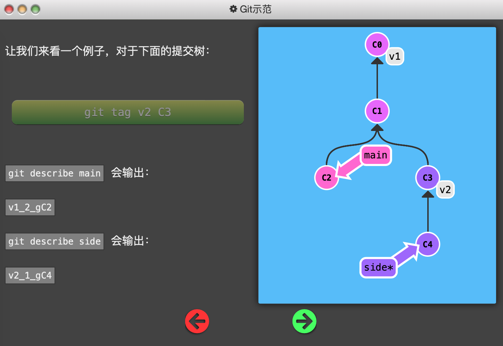
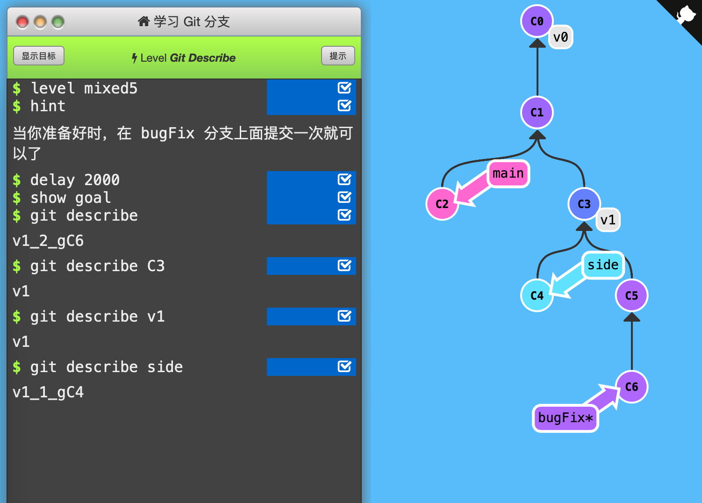

5. Git Describe

   Git Describe 能帮你在提交历史中移动了多次以后找到方向。

   

   用法：`git describe <ref>`，ref是任何提交记录的引用（哈希值、分支名、tag），不指定则默认为HEAD所在位置。

   

   输出：	`<tag>_<numCommits>_g<hash>`，tag是离ref最近的标签，numCommits是ref和tag相差多少个提交记录，hash表示ref的哈希值的前几位。如果ref上有标签，则只输出标签。

   

   

   

   通关记录：本关是体验关，只要在bugFix上commit一下即可过。

   

   4条语句分别测试了：

   默认describe的是HEAD所在提交记录；

   指定提交记录的哈希值；

   指定提交记录的tag；

   指定提交记录的分支名称；

   指定的提交记录如果有tag，输出tag；

   指定的提交记录没有tag，输出`<tag>_<numCommits>_g<hash>`。

   

   