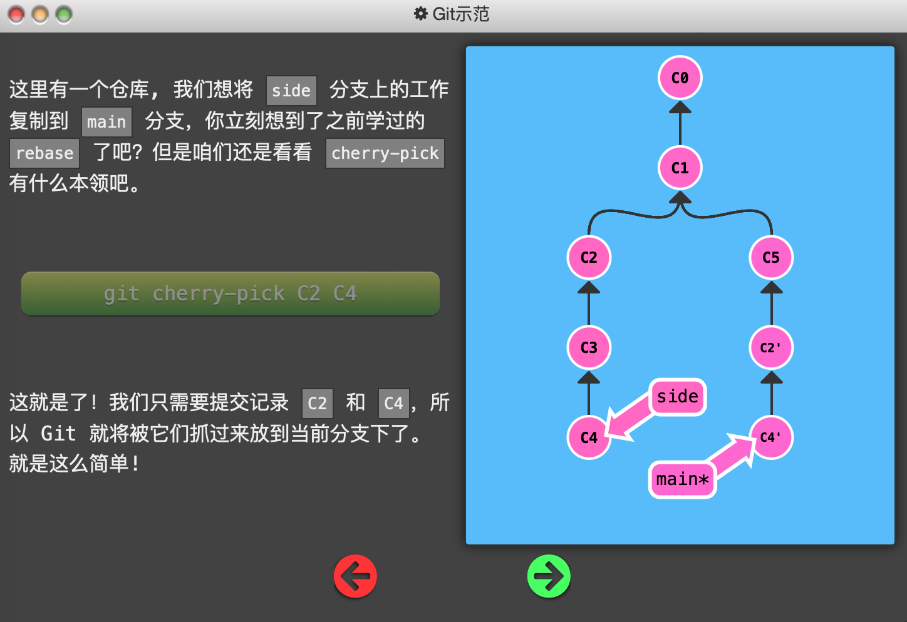
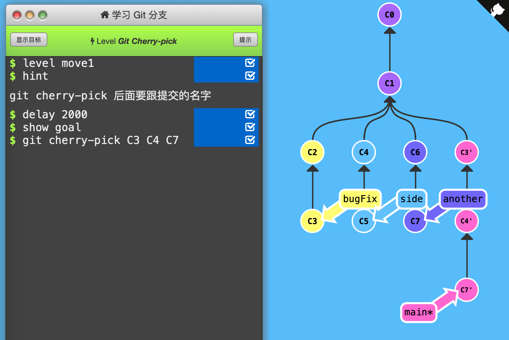

1. Git Cherry-pick

   本节内容讲如何「整理提交记录」，即操控之前那些节点。

   

   `git cherry-pick <提交号>...`命令将一些提交「复制」到当前所在位置「HEAD」的下面。

   

   下图初始状态：C2'和C4'都没有，main*指向C5。

   

   

   

   对比`git rebase <branch_name>`命令，rebase是将当前所在位置复制一份，并加到到目标分支下面，且当前所在位置移动过去了。而`git cherry-pick`仅仅复制了「提交记录」到当前所在位置的下面，并移动了HEAD到最新提交记录。

   

   通关记录：（初始状态：main*指向C1，C3'、C4'、C7'不存在）

   

   用`git cherry-pick`将3个提交记录复制添加到main*下面即可。注意该命令后可跟多个提交记录，会依次按顺序添加。

   

   