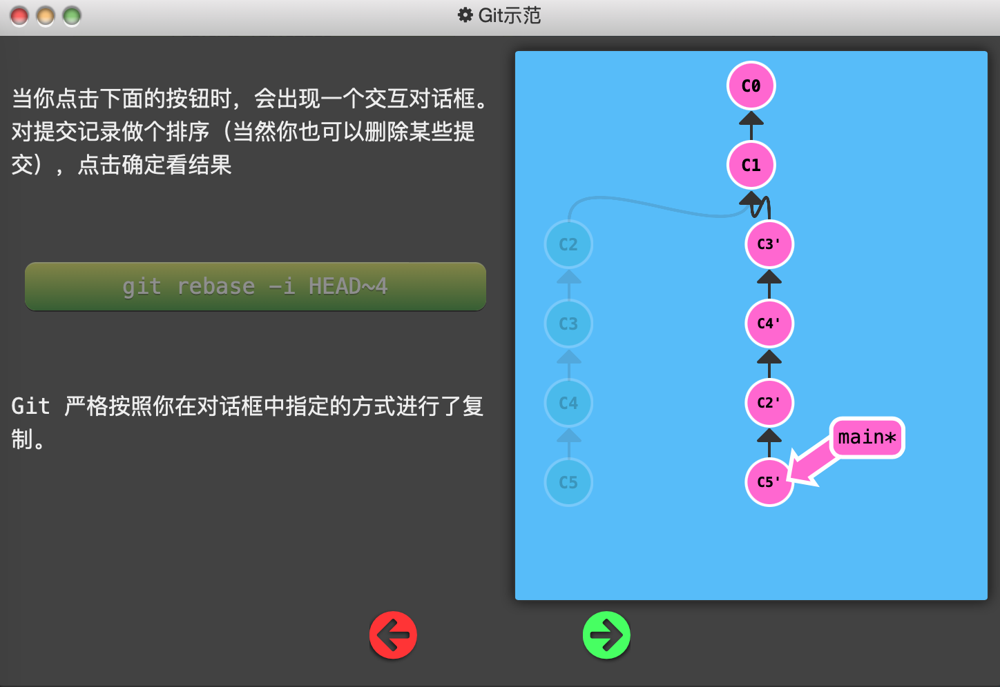
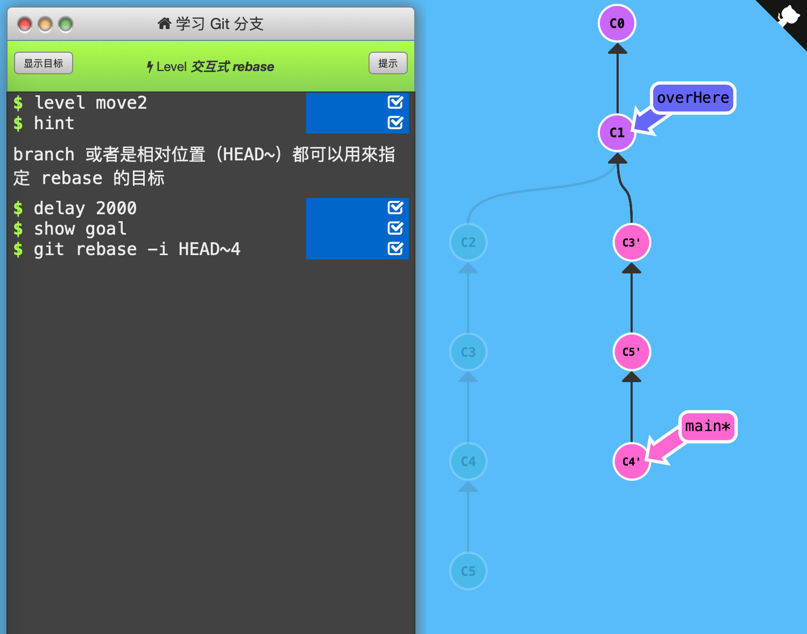

2. 交互式rebase

   `git cherry-pick`虽然好用，但如果不知道提交记录的哈希值，就不那么方便了。因此需要使用交互式rebase从一系列的提交记录中找到想要的记录。

   

   交互式rebase即使用带参数 `--interactive` 的 rebase 命令, 简写为 `-i`。Git 会打开一个 UI 界面（一般是Vim）并列出将要被复制到目标分支的备选提交记录，它还会显示每个提交记录的哈希值和提交说明。

   

   下图初始状态：main*指向C5，右边这一列带'的提交记录都不存在。在课程给出的面板中可以调整C2\~C5节点的顺序、是否加入，最后会按照该顺序rebase到HEAD\~4即C1下面。

   

   

   

   通关记录：（初始状态：和上面的初始状态一样。）

   

   使用`git rebase -i HEAD~4`进入交互式rebase界面，并指定rebase的目标节点为C1。然后根据要求调整节点数量和顺序为C3、C5、C4即可。

   

   