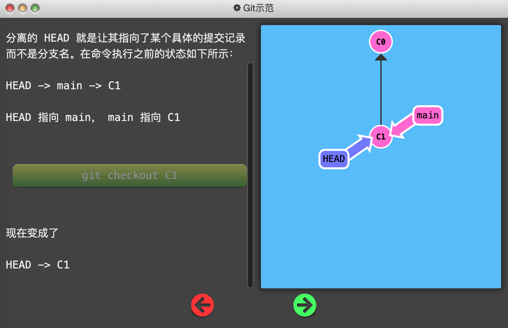
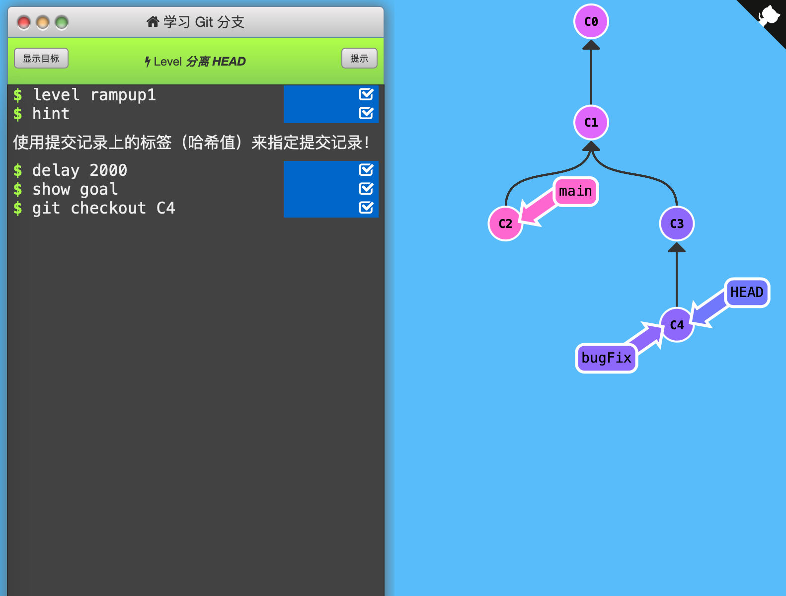

1. 分离HEAD

   「HEAD」 是一个对当前所在分支的符号引用。「HEAD」总是指向当前分支上最近一次提交记录。

   

   「HEAD」 通常情况下是指向分支名的（如 bugFix）。在你提交时，改变了 bugFix 的状态，这一变化通过 「HEAD」 变得可见。

   

   「分离的 HEAD」 就是让其指向了某个具体的提交记录而不是分支名。

   

   注：图中C1、C2等是提交记录的哈希值，现实中不会这么简洁地呈现。但`git checkout <hash_code>`命令确实有用。

   

   

   

   我的理解：HEAD是Git中一个重要的指针，它可以指向分支名（而分支名指向一个提交记录），也可以指向提交记录。通常图中的\*号就表示当前HEAD所指的分支名，没有\*号则HEAD必然指向某个提交记录。也可以理解成：HEAD是隐藏分支名，如果不分离，则与另一个分支名重合。

   

   通关记录：（初始状态：当前所在分支为bugFix（后面有*号），HEAD没有显示出来）

   

   