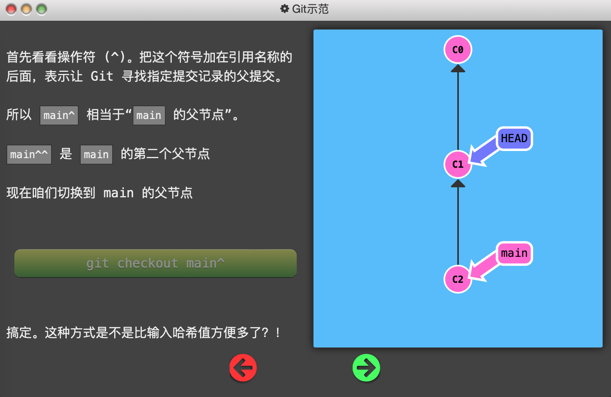
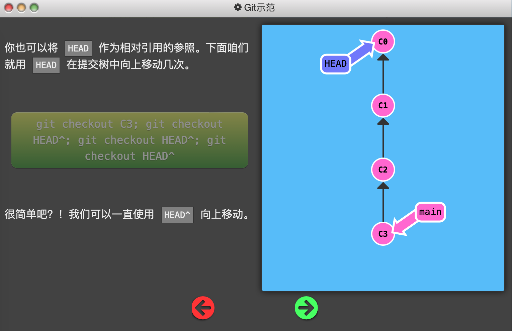
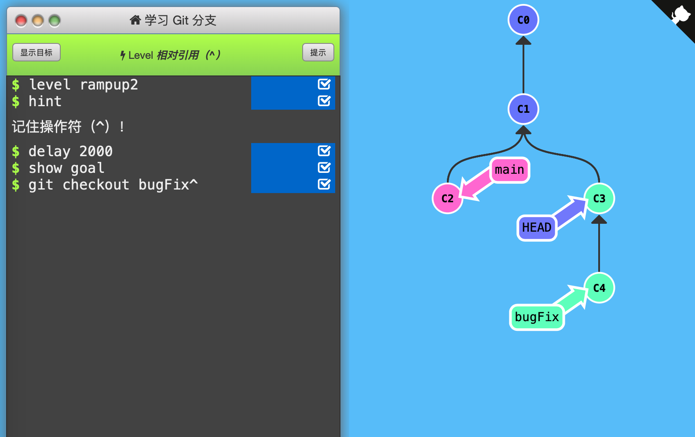

2. 相对引用（^）

   如上一节所说，C1、C2等是提交记录的「哈希值」，现实中的「哈希值」可能是：

   `fed2da64c0efc5293610bdd892f82a58e8cbc5d8`

   

   提交记录的「哈希值」可以使用`git log`命令查看。

   

   但是，Git 对哈希值的处理很智能。只需要提供能够唯一标识提交记录的前几个字符即可。如`fed2`即可识别上面的哈希值。

   

   使用「哈希值」指定提交记录很不方便。因此使用相对引用：

   - 使用 `^` 向上移动 1 个提交记录
   - 使用 `~<num>` 向上移动多个提交记录，如 `~3`

   将上面的符号加在「引用名称」的后面，来寻找提交记录的祖先节点。

   

   

   

   

   

   通关记录：（初始状态：*号在main后面，HEAD没有显示）

   

   