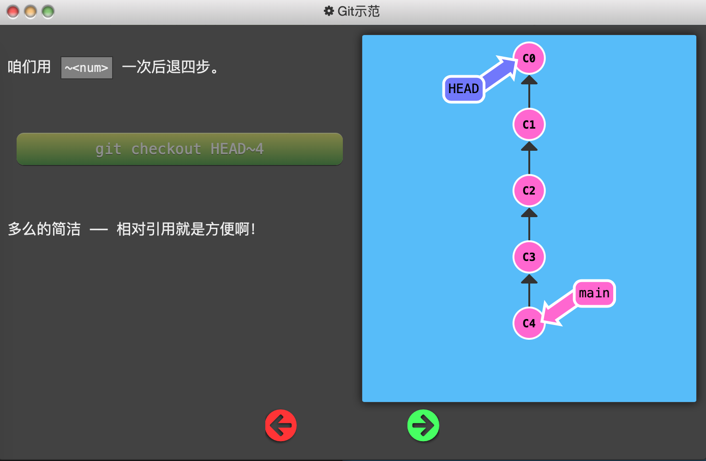
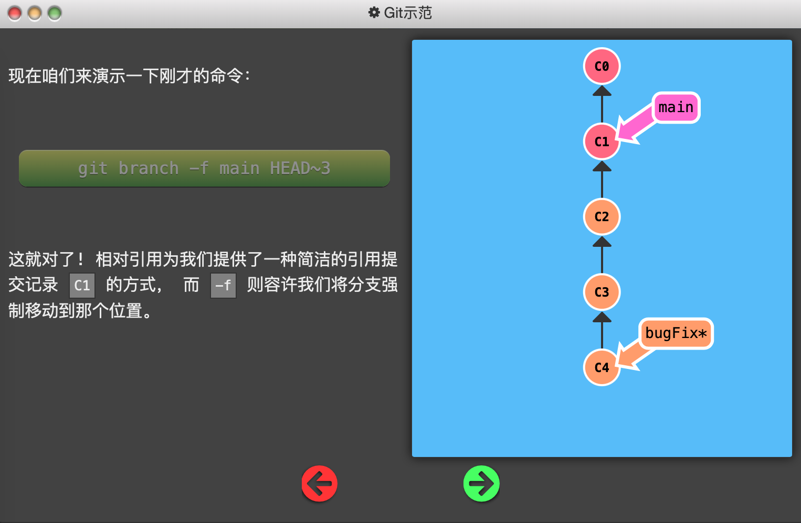
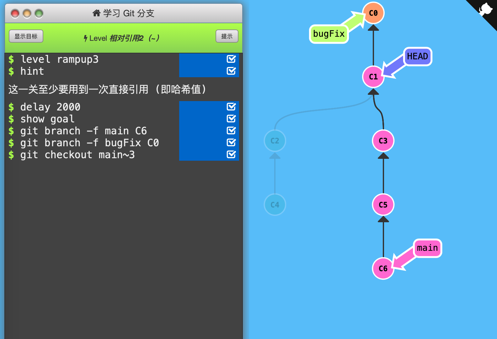

3. 相对引用2（~）

   - 如上一节所说，使用 `~<num>` 可以向上移动多个提交记录。

   

   - 强制修改分支位置：直接使用 `-f` 选项让分支（而不必是HEAD）指向另一个提交。（下图中，初始时main指向C4）

   

   

   通关记录：（初始状态：main指向C4，bugFix指向C5，HEAD指向C2）

   

   依次使用「强制修改分支位置」移动main和bugFix、使用「~相对引用」移动HEAD

   

   