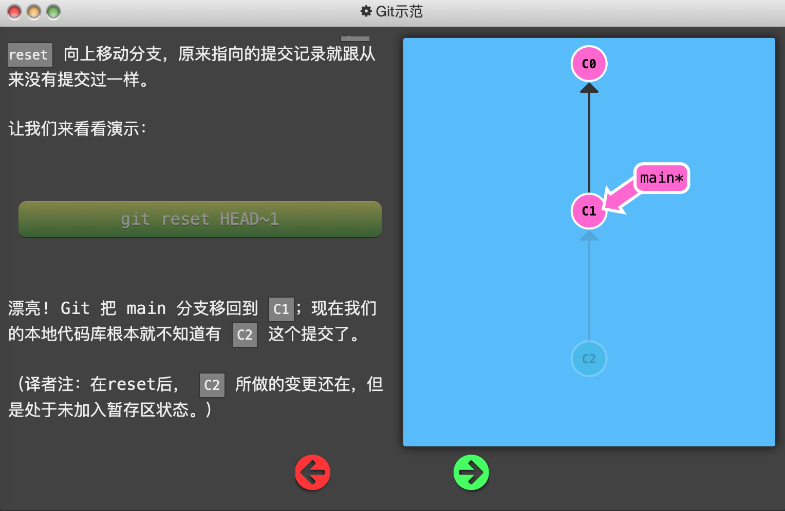
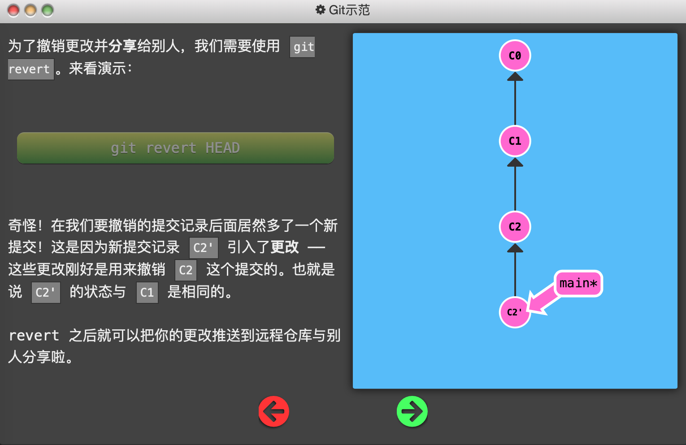
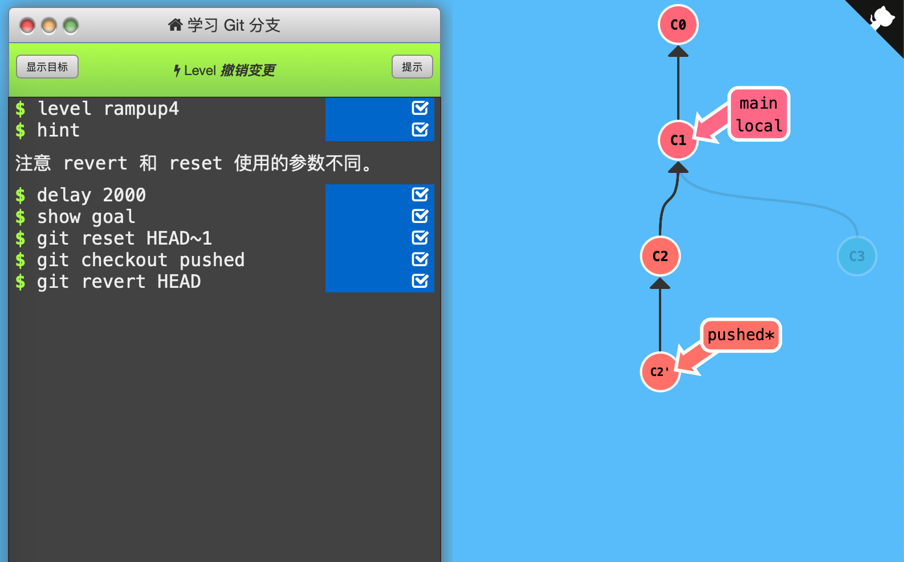

4. 撤销变更

   - 使用`git reset`命令向上移动分支，实现「改写历史」。

   

   - 使用`git revert`命令将撤销后指向的提交记录生成新的提交记录，添加在当前分支上。这样可以将「撤销更改」推送到远程仓库。

   

   

   通关记录：（初始状态：local*指向C3，pushed指向C2）

   

   依次使用`git reset`撤销「HEAD所指」的local分支，使之指向C1；使用`git checkout`将HEAD指向pushed分支；使用`git revert`撤销pushed分支，生成与C1内容相同的C2'提交记录。（注意，revert前先分离HEAD至pushed，才能在C2下面生成新提交记录）

   

   