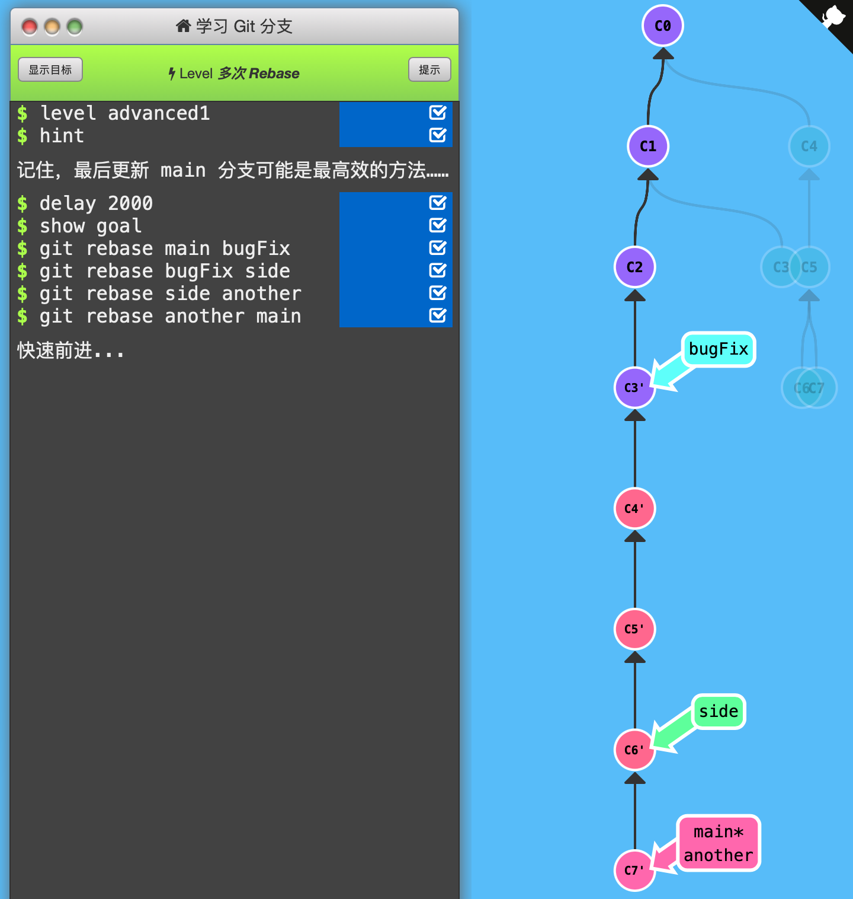

1. 多次Rebase

   通关记录：（初始状态：带'的节点都不存在；C2 main*，C3 bugFix，C6 side，C7 another）

   

   注意：`git rebase branch1 branch2`会将branch2到两个分支最近公共父节点之间的分支提交记录都复制并移动到branch1下，且HEAD移动到新节点上。

   

   如果两个分支的公共父节点相同（都在一个分支上，如最后的main 和another），则是将branch2指向branch1的节点，且HEAD指向branch2。

   

   