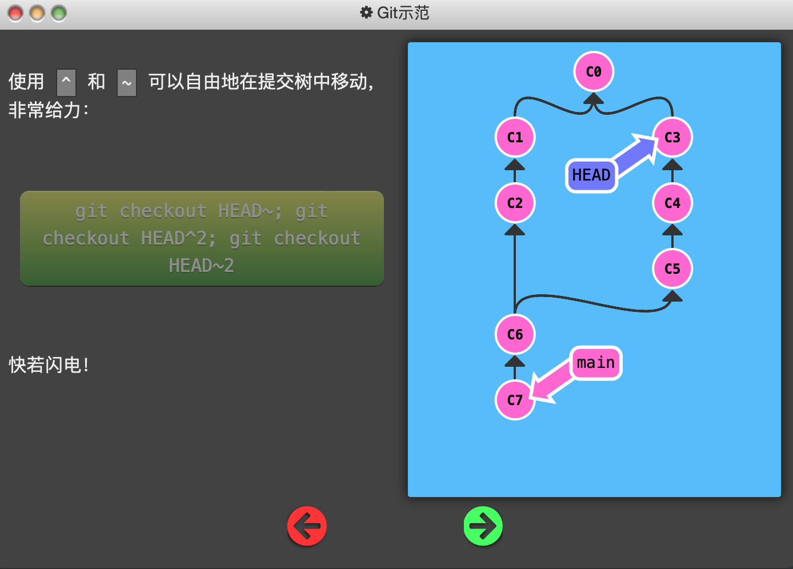
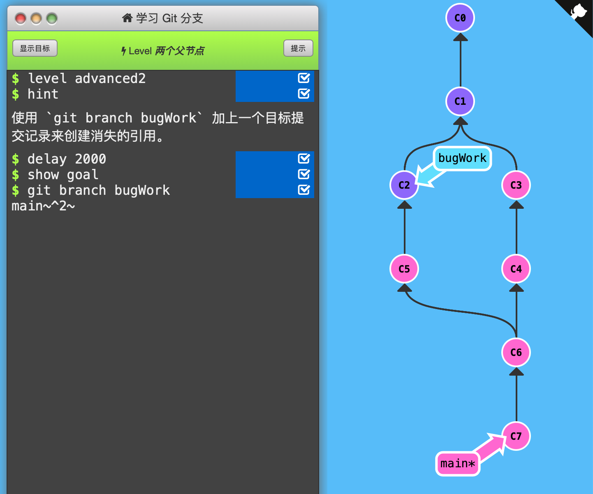

2. 两个父节点

   前面讲的merge会创建拥有两个父节点的新节点。因此，当在分支树中移动时需要注意移动到哪个父节点那边。^+数字可以指定移动到第几个父节点。

   

   下面的例子中，通过checkout不断移动HEAD。HEAD~n表示向上移动n次（没有n则1次），HEAD^2表示移动到第二个父节点（移动1次而不是2次）。因此，这段代码使得HEAD的移动路径为：C7-C6-C5-C3。

   

   另外，这段代码可以简写成：`git checkout HEAD~^2~2`。效果一样。

   

   

   

   通关记录：（初始状态：bugWork不存在）

   

   